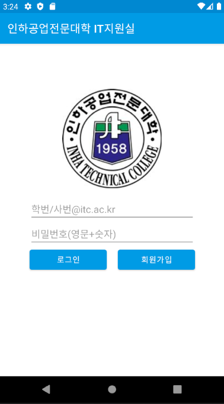
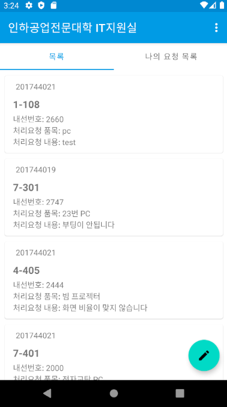
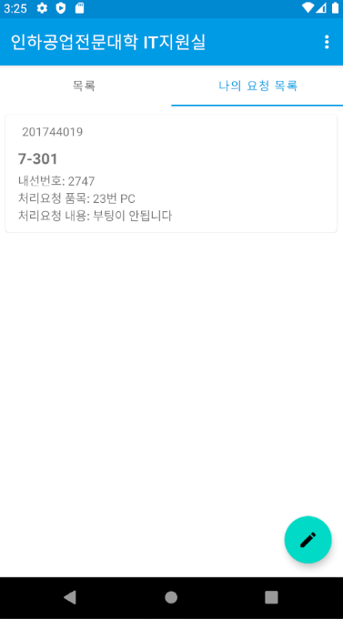
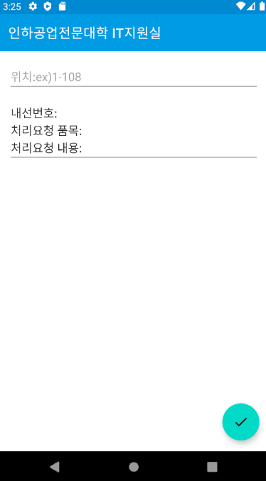
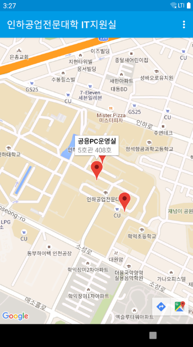
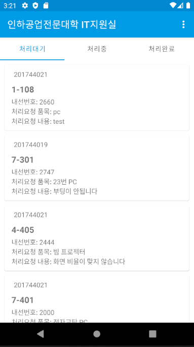

A.S.M.R.(After Service Mobile Request)
=======================================

Introduction
------------

- 게시판 형식의 A/S접수 어플리케이션

Getting Started
---------------

- [Add Firebase to your Android Project](https://firebase.google.com/docs/android/setup).
- Log in to the [Firebase Console](https://console.firebase.google.com).
- Go to **Auth** tab and enable **Email/Password** authentication.
- Create database at [Realtime Database](https://firebase.google.com/products/realtime-database?hl=ko).
- Run the sample on Android device or emulator.

Result
-----------
-사용자 로그인시

-관리자 로그인시

